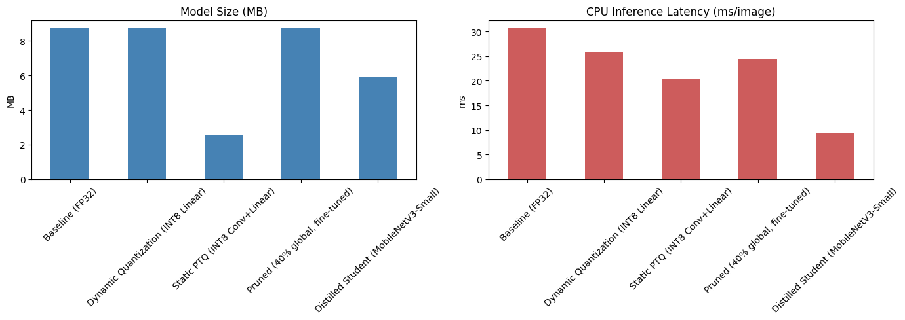

# embedUR | Structured Training program AI - ML
------------------------------------------------
The repository consist of set of questions given as assessment by the embedUR technical panel. 

## Table of Content:
------------------------------------------------
1. [About the Projects](#about-the-projects)
2. [Repository Structure](#repository-structure)
3. [Requirements and Installation](#requirement-and-installation)

## About the Projects
-------------------------------------------------
The project consist of various folder containing scripts related to various AI related problems posted as assessment. The  techniques used for solving each project is as follow,

1) Customer Sales Analysis - Used Pandas to clean the dataset, handle missing values, computed the total revenues by product, identified top 10 highest income dates (as the customer name column was not available) and visualized the monthly sales summary using matplotlib. 
    
    - Shipped the deliverables such as scripts, summary statistics and plots
    - Dataset Used:  [Walmart Sales Dataset](https://www.kaggle.com/datasets/antaesterlin/walmart-commerce-data)

2) Log File Analyzer -  Parsed the log files, cleaned the dataset, grouped the log based on error and warning, then created a CSV report shoeing showing error frequency with following columns Level,Source,Count,Total Count (by Level),Percentage.

    -  Shipped the deliverables such as script and the CSV report
    - Dataset Used: Personal Computers log from log viewer for Windows

3) Simple Iris Classifier - Used the Irish dataset from Scikit-learn python library, split the dataset into training and testing/validation set the build a decision tree (selected param using grid search) and used GINI impurity as   attribute selection measure (criterion). Got accuracy of 96%+ across various 5 folds of cross validation 

    - Shipped the deliverables such as the training code 
    - Dataset used: Build-in Scikit-Learn Python Irish dataset

4)  MNIST Digit Recognition - Build a digit classifier with MNIST dataset. Used Logistic regression with SAGA (Stochastic Average Gradient Accelerated) as optimization solver since most of the features were on same scale and got an accuracy of 92% across test sets.

    - Shipped deliverables and observations
    - Dataset used: Build-in scikit-lean Python MNIST Dataset from openML

5)  Titanic Survival Prediction - Cleaned missing vales, Performed EDA, Engineered features across the dataset (derived new feature, removed unwanted features) ans used logistic regression and Random forest across the noisy data and got an accuracy of 80% and 81.8% respectively. The reason for the drop is the noisy and sparse nature of the dataset

    - Shipped the training code, evaluation metric and Justifications
    - Dataset Used: [Titanic Survival Prediction - Kaggle](https://www.kaggle.com/datasets/yasserh/titanic-dataset)

6) Spam Email Classification - Used an text message dataset, cleaned that,  vectorized into TF_IDF format and build a naive bayes classifier on that to classify the text as spam or not.

    - Shipped the working classifier and evaluation report
    - Dataset used: [Spam or Ham Dataset from kaggle](https://www.kaggle.com/datasets/ozlerhakan/spam-or-not-spam-dataset/data)

7) Created a reusable python pipeline for loading, preprocessing and normalize the images. it is also capable of splitting the image into testing and validation sets and store them back to local disk along with a metadata.csv containing info about the split and path to the images.

    - Shipped the pipeline design and prototype implementation
    - Dataset Used: Tested by simulating random noise and used them as input images.

8) Image Classification Pipeline - Designed an end to end ML pipeline for classifying defect product. Since it is an anomaly detection problem. I used Patch Distribution Modelling (a high interpretable, probabilistic distribution model) in which i pass the imaged through a pre-trained resnet extracted it's features and measured the variance of inference picture with the obtained feature map, from the RESNET model and predicted the class of image.

    - Shipped the pipeline design and prototype implementation
    - Dataset used: [MvTec Dataset for Manufacturing Defects](https://www.mvtec.com/research-teaching/datasets/mvtec-ad/downloads)

9) Face Mask Detection: Fine-tuned a pre-trained mobilenet model for face mask detection. Used a 2 stage process one to identify the presence of face in the scene and the other to detect the presence on mask in the detected face. Got precision, accuracy and recall of 99% and the Inference speed was around 57ms.

    Optimized the model using methods such as 
    
    i. Quantization
    ii. Pruning
    iii. Distillation

    This process lead to reduction in memory-footprint and  inference speed. The results are
    

    - Yet to complete the presentation on the project
    - Dataset used: [ai4privacy/pii-masking-200k](https://huggingface.co/datasets/ai4privacy/pii-masking-200k/blob/main/english_pii_43k.jsonl)

10) Mini Project - "Redact Personally  Identifiable Information with AI":
    Build a Redacting AI for masking PII using multi-lingual BERT. Fine-tuned the mBERT model on AI4Privacy public dataset for english language.

11) onboarding-OpenCV - Contains scripts related to the week 2 OpenCV assessment.

## Repository Structure

```text
AI_ML-ASSESSMENT
│
├── .venv/                              # Python virtual environment
├── certificates/                       # Course certificates
│
├── customer_sales_analysis/            # Customer Sales Analysis Project
├── face_mask_detection/                # Face Mask Detection using Deep Learning
├── image_classification/               # Image Classification Models
├── iris_classifier/                    # Iris Flower Classification
├── log-file-analyzer/                  # Log File Analysis using ML
├── manufacturing-defect-detection/     # Defect Detection Project
├── mini-project/                       # PII Redaction using BERT
├── MNIST-digit-recognition/            # Handwritten Digit Recognition
├── onboarding-OpenCV/                  # OpenCV Assignments
├── spam-email-classification/          # Spam Email Detection
├── titanic_survival_prediction/        # Titanic Survival Prediction
│
├── .env                                # Environment variables
├── .gitignore                          # Git ignore rules
├── .python-version                     # Python version
├── image.png                           # Result image to display in ReadMe
├── pyproject.toml                      # Project dependencies
├── README.md                           # Project documentation
└── uv.lock                             # Dependency lock file
```

## Requirements and Installation

### Prerequisites

Before running the projects, ensure you have the following installed:

- Python 3.11 or >
- uv (Python package manager)

### Clone the Repository

```bash
git clone https://github.com/SUDAR2005/AI_ML-ASSESSMENT.git
cd AI_ML-ASSESSMENT
```

### Install uv

If you don't have uv installed:

Windows (PowerShell)

```powershell
powershell -ExecutionPolicy ByPass -c "irm https://astral.sh/uv/install.ps1 | iex"
```

macOS / Linux

```bash
curl -LsSf https://astral.sh/uv/install.sh | sh
```

Or install using pip:

```bash
pip install uv
```

### Create the Virtual Environment

```bash
uv venv
```

Activate the environment:

Windows

```bash
.venv\Scripts\activate
```

macOS / Linux

```bash
source .venv/bin/activate
```

### Install Dependencies

```bash
uv sync
```

This command installs all dependencies specified in `pyproject.toml` and locks them according to `uv.lock`.
